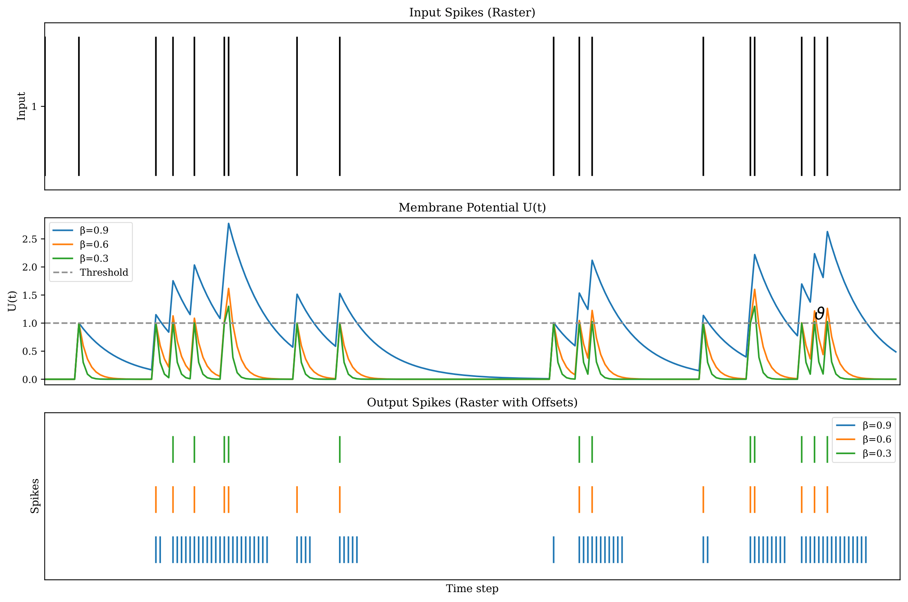
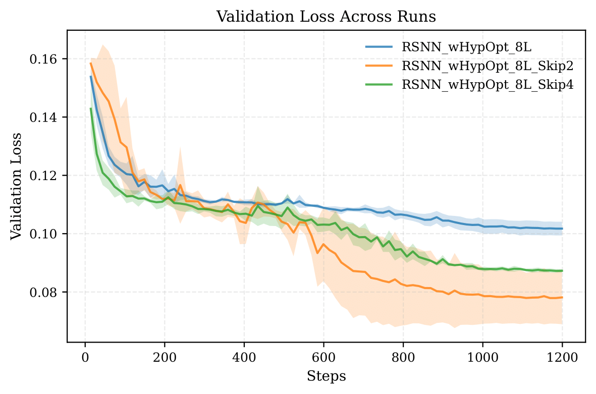

# 🧠 Flex-Spike: Analysis of Flexible Analog Spiking Neural Network Architecture for Neuromorphic Learning

[](LICENSE)
[](https://www.python.org/)
[](https://nixos.org/)

> [!NOTE]
> This project is currently in development as part of a bachelor’s thesis.

| Simulation                               | Comparison                                    |
| ---------------------------------------- | --------------------------------------------- |
|  |  |


## 🚀 Installation

Clone the repository:

```sh
git clone https://github.com/LuposX/SpikeSynth.git
cd SpikeSynth
```

### Using Nix

Use Nix to install the required Python packages and enter a development shell:

```sh
nix develop
```

### Using Pip

Alternatively, install dependencies with Pip:

```sh
pip install -r requirements.txt
```


## 🧩 Usage

### Surrogate

To create the surrogate model, navigate to the `surrogate` folder.
Place your **SPIKE data** for the circuit you want to simulate into the `data` directory — alternatively see the [Data section](#data).

1. Use the notebook `1_create_surrogate_dataset.ipynb` to generate the dataset.
   The resulting dataset is stored as `data/dataset.ds`.

2. Train the surrogate model using one of the scripts:

   * `2_train_gpt_surrogate.py` — baseline GPT surrogate
   * `2_train_rsnn_surrogate.py` — RSNN surrogate
   * `4_train_rnn_surrogate.py` — non-spiking surrogate

   Logging requires a **Weights & Biases (wandb)** account.

3. Run hyperparameter optimization:

   ```sh
   python 3_hyperparameter_search_rsnn.py
   ```

### Running Hyperparameter Search and Training on a Cluster

If your cluster uses **SLURM**, the `surrogate` folder provides SLURM scripts:

* `slurm_spiking.sh` — train a **spiking** model
* `slurm_sweep_spiking.sh` — hyperparameter **search** for spiking models
* `slurm_non_spiking.sh` — train a **non-spiking** model
* `slurm_sweep_non_spiking.sh` — hyperparameter **search** for non-spiking models

#### Workflow

1. Edit the script to adjust task parameters.
2. Submit the job:

   ```sh
   sbatch slurm_sweep.sh
   ```
3. Estimate job start time:

   ```sh
   squeue --start -j <job-id>
   ```
4. View running jobs:

   ```sh
   squeue -u $USER
   ```

SLURM logs are written to the `logs_slurm` directory.


### Visualization

The notebook `utils/generate_graphics.ipynb` can generate:

* spiking neuron simulation plots
* loss curves
* spiking activity plots
* gradient magnitude during backpropagation
* hyperparameter sweep contour plots
* mean & standard deviation for repeated runs
* improvement over baselines
* Bayesian improvement plots
* bar plots for test metrics


### pLSNN

To train the full pLSNN model, use:

```
train_pRSNN.ipynb
```

* To include **variation**, replace `exp_pSNN_lP.py` with `exp_pSNN_var_lP.py`.
* To reproduce the **baseline approach** from [1], switch to `exp_pSNN.py`.
  A separate surrogate model must be trained in the `surrogate_baseline` directory.


## 📂 Data

Experimental data for this project can be found:

* [Dataset link 1](https://1drv.ms/f/c/a31285484594c370/ErPw8IcCU5tCl2CpgQnXkj8BY41yb5YgZAaSnQjNQNRNEw?e=On30Sp)
* [Dataset link 2](https://onedrive.live.com/?redeem=aHR0cHM6Ly8xZHJ2Lm1zL3UvYy9hMzEyODU0ODQ1OTRjMzcwL0VkQldtOTNkOWdSSXZka2t3czI2RXc0QkhrM3hnY2c2eUhtZmk4c0FramRfSEE%5FZT1DSk45eDE&cid=A31285484594C370&id=A31285484594C370%21sdd9b56d0f6dd4804bdd924c2cdba130e&parId=A31285484594C370%21s87f0f0b35302429b9760a98109d7923f&o=OneUp)


## 🤝 Credits and References

This repository is based on the ICCAD 2025 paper and its GitHub repo:
**SpikeSynth: Energy-Efficient Adaptive Analog Printed Spiking Neural Networks**.

[1] Pal, P.; Zhao, H.; Shatta, M.; Hefenbrock, M.; Mamaghani, S. B.; Nassif, S.; Beigl, M.; Tahoori, M. B.
*“Analog Printed Spiking Neuromorphic Circuit,”*
2024 Design, Automation & Test in Europe Conference & Exhibition (DATE), IEEE, 2024.

## 🪪 License

This project is licensed under the [MIT License](LICENSE).